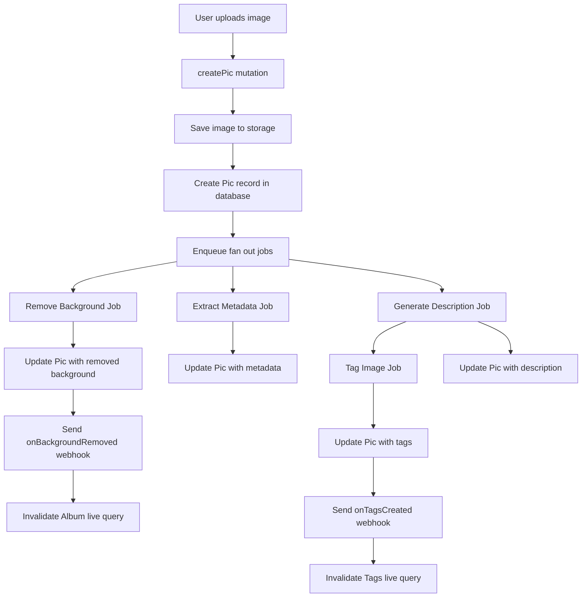

# PicThang

A tribute to [PicThing](https://pic.ping.gg/login)

## Features

- [x] Albums
- [x] Upload images using RedwoodJS Storage
- [x] Background removal using [birefnet on fal.ai](https://fal.ai/models/fal-ai/birefnet)
- [x] RedwoodJS background jobs for:
  - Background removal using [birefnet on fal.ai](https://fal.ai/models/fal-ai/birefnet)
  - Image description using [florence-2-large on fal.ai](https://fal.ai/models/fal-ai/florence-2-large/more-detailed-caption)
  - Automatic image tagging using [Langbase](https://www.langbase.com/)
- [x] Real-time live query updates for processed images and tags
- [x] Search functionality with pagination
- [x] Dark mode support
- [x] Rate limiting using [Unkey](https://unkey.com/)
- [x] uuid generation using [The UX of UUIDs](https://www.unkey.com/blog/uuid-ux) pattern   from [Unkey](https://unkey.com/)

## Technologies Used

- [RedwoodJS](https://redwoodjs.com/) for the full stack framework with jobs, storage, uploads, and more
- [Tailwind CSS](https://tailwindcss.com/) for styling
- [Prisma](https://www.prisma.io/) for the database ORM
- [GraphQL](https://graphql.org/) for the API
- [Fal.ai](https://fal.ai/) for AI-powered background removal and image description
- [Langbase](https://langbase.com/) for composable AI models used to generate image tags
- [Unkey](https://unkey.com/) for rate limiting
- [Cursor](https://cursor.com/) for AI-powered code generation

## Getting Started

1. Clone the repository
2. Install dependencies: `yarn install`
3. Set up your environment variables (see `.env.example`)
4. Run database migrations: `yarn rw prisma migrate dev`
5. Start the development server: `yarn rw dev`

## Project Structure

- `api`: Backend API code
- `web`: Frontend web application
- `scripts`: Utility scripts
- `api/src/services`: GraphQL resolvers and business logic
- `api/src/graphql`: GraphQL schema definitions
- `api/src/jobs`: Background job definitions
- `web/src/components`: React components
- `web/src/pages`: Page components and routing

## Key Features

### Image Upload and Processing

Images can be uploaded to albums and are automatically processed in the background. The processing includes:

1. Metadata extraction (EXIF data, dimensions, format)
2. Background removal
3. AI-powered image description
4. Automatic tagging based on the description

### Album Management

Users can create and manage multiple albums to organize their images.

### Tagging System

Images are automatically tagged based on their AI-generated descriptions, allowing for easy categorization and searching.

### Dark Mode

The application supports both light and dark modes for user preference.

### Flow Diagram

This diagram illustrates the flow from image upload to the completion of all background jobs. Here's a brief explanation of each step:

1. User uploads an image
2. The `createPic` mutation is called
3. The image is saved to storage
4. A new Pic record is created in the database
5. Background jobs are enqueued
6. Three jobs run in parallel:
   - Remove Background Job
   - Extract Metadata Job
   - Generate Description Job
7. The Tag Image Job runs after the Generate Description Job completes
8. Each job updates the Pic record with its respective results

This flow diagram provides a clear visual representation of the image processing pipeline in your application.

## TODO (maybe)

- [ ] Implement user authentication and authorization
- [ ] Copy to clipboard button for image data
- [ ] Add more advanced image editing features

## Contributing

Contributions are welcome! Please feel free to submit a Pull Request.

## License

This project is open-source and available under the [MIT License](LICENSE).
