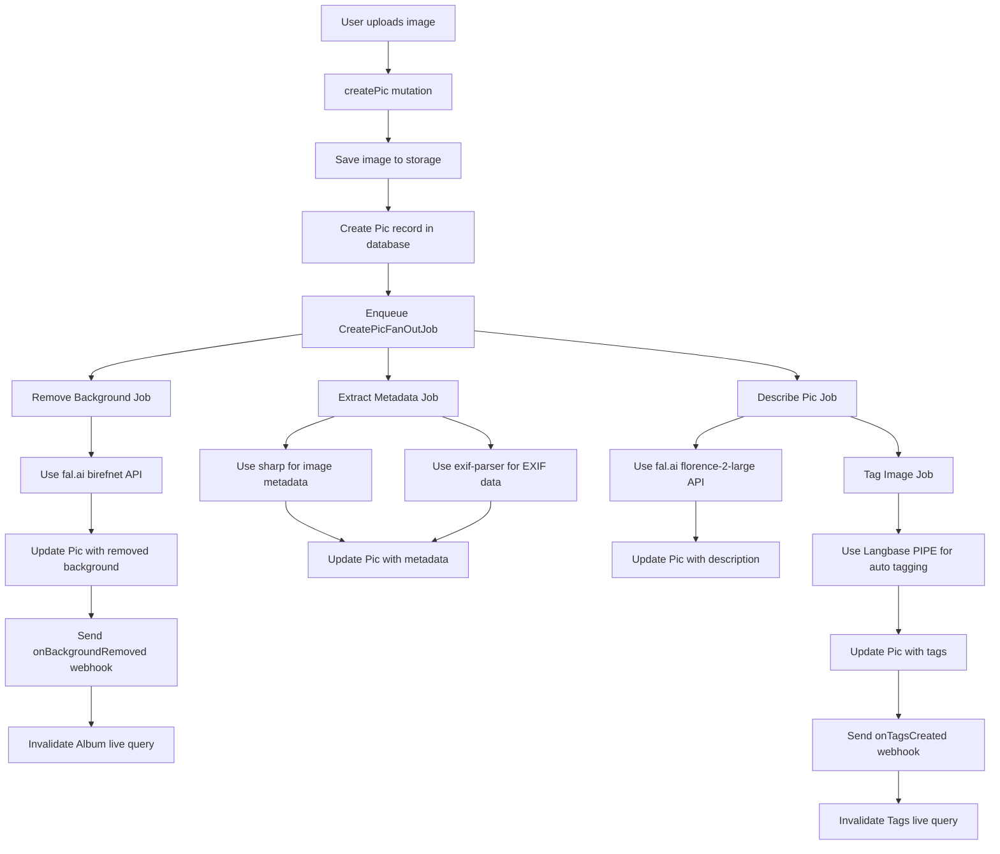

# PicThang

A tribute to [PicThing](https://pic.ping.gg/login) by [Ping](https://ping.gg) and [Theo](https://t3.gg). Watch [video about PicThing](https://www.youtube.com/redirect?event=video_description&redir_token=QUFFLUhqbFBrR1pKLXJqSV93eFVwbjduZ3YzRkVRYmd0d3xBQ3Jtc0tuZ3pjWWxCUU8xYzhxd2M3N1g2eXZYdEM4WkYwWlBWNFVGUlZJMjAyQUxFZ2w3Q3lpQUFIYUx3RHlRRHdQNE1yMEVtTHEwODJBalo2YXJDTFY4MnRHd0ZEVlpwWEVwZXNaSEhtNlF6M3NhRkcwSVYtOA&q=https%3A%2F%2Ft3.gg%2F&v=x5hsXlqScYo) to see how it works.

Note:

This project isn't meant to be a clone or a direct replacement for PicThing. When the video came out, RedwoodJS had just launched [Background Jobs](https://docs.redwoodjs.com/docs/background-jobs) and an upcoming Storage/Upload feature is in canary. We need a proper app to put these through its paces and PicThing inspired me to see if RedwoodJS could do it.

Spoiler: It can! 😀

Is this project different? Yes. The background removal is done  using [birefnet on fal.ai](https://fal.ai/models/fal-ai/birefnet) and there is no image CDN and isn't as fast (but still pretty fast given the processing is done in background jobs).

The UX is different from what I can tell. I added albums to manage pics and a search and a "tag-cloud-heat-map" UI to show pics by tag.

Instead of toggling the background removal on and off, I made it so you can download the background removed version or hover to see the original.

We have automatic image tagging using [Langbase](https://langbase.com/) [tagify-image-description PIPE](https://langbase.com/dthyresson/tagify-image-description) and based on a generated description via [florence-2-large on fal.ai](https://fal.ai/models/fal-ai/florence-2-large/more-detailed-caption).

We have automatic image tagging using [Langbase](https://langbase.com/) [PIPE]() and  based on a generated description via [florence-2-large on fal.ai](https://fal.ai/models/fal-ai/florence-2-large/more-detailed-caption).

There's currently no user management or photos associated with the account. It can't copy paste yet either -- but it can download.

That said, it has a great set features and showcases the power of RedwoodJS for Jobs, Storage, Uploads, GraphQL, Realtime, and more.

## Features

- [x] Albums
- [x] Upload images using RedwoodJS Storage
- [x] Background removal using [birefnet on fal.ai](https://fal.ai/models/fal-ai/birefnet)
- [x] RedwoodJS background jobs for:
  - Background removal using [birefnet on fal.ai](https://fal.ai/models/fal-ai/birefnet)
  - Image description using [florence-2-large on fal.ai](https://fal.ai/models/fal-ai/florence-2-large/more-detailed-caption)
  - Automatic image tagging using [Langbase](https://www.langbase.com/)
- [x] Real-time live query updates for processed images and tags
- [x] Search functionality with pagination
- [x] Download background removed image via function
- [x] Dark mode support
- [x] Rate limiting using [Unkey](https://unkey.com/)
- [x] uuid generation using [The UX of UUIDs](https://www.unkey.com/blog/uuid-ux) pattern   from [Unkey](https://unkey.com/)
- [x] custom generator templates for SDL Codegen and Cells with custom lifecycle components
- [x] QR code on server startup for easy mobile app access
- [x] About page generation script `about.ts` with project README details with flow diagram

## Technologies Used

- [RedwoodJS](https://redwoodjs.com/) for the full stack framework with jobs, storage, uploads, and more
- [Tailwind CSS](https://tailwindcss.com/) for styling
- [Prisma](https://www.prisma.io/) for the database ORM
- [GraphQL](https://graphql.org/) for the API
- [Fal.ai](https://fal.ai/) for AI-powered background removal and image description
- [Langbase](https://langbase.com/) for composable AI models used to generate image tags
- [Unkey](https://unkey.com/) for rate limiting
- [Cursor](https://cursor.com/) for AI-powered code generation

## Getting Started

1. Clone the repository
2. Install dependencies: `yarn install`
3. Set up your environment variables (see `.env.example`)
4. Run database migrations: `yarn rw prisma migrate dev`
5. Start the development server: `yarn rw dev`

## Project Structure

- `api`: Backend API code
- `web`: Frontend web application
- `scripts`: Utility scripts
- `api/src/services`: GraphQL resolvers and business logic
- `api/src/graphql`: GraphQL schema definitions
- `api/src/jobs`: Background job definitions
- `web/src/components`: React components
- `web/src/pages`: Page components and routing

## Key Features

### Image Upload and Processing

Images can be uploaded to albums and are automatically processed in the background. The processing includes:

1. Metadata extraction (EXIF data, dimensions, format)
2. Background removal
3. AI-powered image description
4. Automatic tagging based on the description

### Album Management

Users can create and manage multiple albums to organize their images.

### Tagging System

Images are automatically tagged based on their AI-generated descriptions, allowing for easy categorization and searching.

### Dark Mode

The application supports both light and dark modes for user preference.

### Flow Diagram



This diagram illustrates the flow from image upload to the completion of all background jobs. Here's a brief explanation of each step:

1. User uploads an image
2. The `createPic` mutation is called
3. The image is saved to storage
4. A new Pic record is created in the database
5. The `CreatePicFanOutJob` is enqueued
6. Three jobs are enqueued by the `CreatePicFanOutJob`:
   - Remove Background Job
   - Describe Pic Job
   - Extract Metadata Job
7. The Tag Image Job runs after the Describe Pic Job completes
8. Each job updates the Pic record with its respective results
9. Webhooks are sent after background removal and tag creation to invalidate live queries

Note: In the "Use Langbase for tagging" step, the application uses a custom prompt that is shown in `prompts/tagify-image-description.md`. This prompt instructs the AI to generate tags based on the image description, following specific rules for tag creation.

### Job Queues and Priorities

The application uses RedwoodJS's job system to orchestrate the flow of image processing tasks. Different queues and priorities are used to ensure efficient processing:

- The CreatePicFanOutJob runs on the 'critical' queue with priority 10.

```10:13:api/src/jobs/CreatePicFanOutJob/CreatePicFanOutJob.ts
export const CreatePicFanOutJob = jobs.createJob({
  queue: 'critical',
  priority: 10,
  perform: async (picId: string) => {
```

- The Remove Background Job runs on the 'critical' queue with priority 20.

```13:16:api/src/jobs/RemoveImageBackgroundJob/RemoveImageBackgroundJob.ts
export const RemoveImageBackgroundJob = jobs.createJob({
  queue: 'critical',
  priority: 20,
  perform: async (picId: string) => {
```

- The Describe Pic Job runs on the 'default' queue with priority 20.

```10:13:api/src/jobs/DescribePicJob/DescribePicJob.ts
export const DescribePicJob = jobs.createJob({
  queue: 'default',
  priority: 20,
  perform: async (picId: string) => {
```

- The Tag Image Job runs on the 'default' queue with priority 10.

```12:15:api/src/jobs/TagifyPicJob/TagifyPicJob.ts
export const TagifyPicJob = jobs.createJob({
  queue: 'default',
  priority: 10,
  perform: async (picId: string) => {
```

- The Extract Metadata Job runs on the 'default' queue with priority 30.

```15:18:api/src/jobs/ProcessPicMetadataJob/ProcessPicMetadataJob.ts
export const ProcessPicMetadataJob = jobs.createJob({
  queue: 'default',
  priority: 30,
  perform: async (picId: string) => {
```

This setup allows for efficient resource utilization and ensures that critical jobs like background removal are processed quickly. The use of different queues and priorities ensures that faster jobs don't get blocked behind longer-running tasks. The use of webhooks for live query invalidation ensures that the UI stays up-to-date as jobs complete, providing a responsive user experience.

## TODO (maybe)

- [ ] Implement user authentication and authorization
- [ ] Copy to clipboard button for image data
- [ ] Add more advanced image editing features

## Contributing

Contributions are welcome! Please feel free to submit a Pull Request.

## Note

The About page is automatically generated using the `about.ts` script. This script reads the `README.md` file and generates a React component that is then used to render the About page. The flow diagram is generated using [Mermaid](https://mermaid.js.org/).
